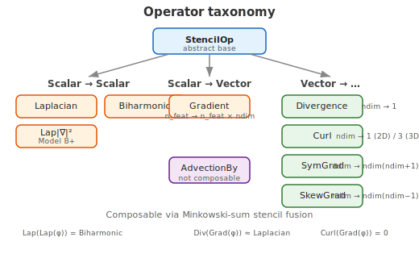
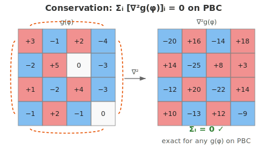

.. _spde-user-guide:

Spatial field inference (SPDE)
==============================

.. admonition:: Experimental
   :class: warning

   The SPDE toolbox is functional but **experimental** in this release:
   its API may change, and only the linear estimators
   (:meth:`~SFI.inference.OverdampedLangevinInference.infer_force_linear`, :meth:`~SFI.inference.OverdampedLangevinInference.infer_diffusion_linear`) are validated on
   grid layouts.

When your data lives on a **regular grid** — concentration fields,
density maps, velocity grids, microscopy images — the force to infer is
a *functional* of the field, typically expressed through spatial
differential operators (Laplacians, gradients, etc.).  SFI's SPDE
toolbox provides:

1. **Composable stencil operators** — :class:`~SFI.bases.spde.Laplacian`,
   :class:`~SFI.bases.spde.Gradient`, :class:`~SFI.bases.spde.Biharmonic`,
   :class:`~SFI.bases.spde.LaplacianOfGradientSquared`,
   :class:`~SFI.bases.spde.Divergence`, :class:`~SFI.bases.spde.Curl`,
   :class:`~SFI.bases.spde.SymGrad`, :class:`~SFI.bases.spde.SkewGrad`,
   and :class:`~SFI.bases.spde.AdvectionBy` — that you apply
   to any pointwise expression of the fields.  Operators can be
   **composed** (e.g. ``Div(Grad(phi))``), automatically fusing
   their stencils via Minkowski-sum offset arithmetic.

2. **Grid-aware noise models** — conserved (divergence-form) and
   composite noise for simulation and inference.

3. Full integration with SFI's basis algebra, sparsification, and
   Langevin simulation pipeline.

Conceptual picture
------------------

An SPDE on a regular grid with field :math:`\phi(\mathbf{r}, t)` takes
the general form

.. math::

   \dot\phi_i = \mathcal{F}[\phi]_i + \eta_i(t)

where :math:`i` runs over grid sites, :math:`\mathcal{F}` is a
(typically nonlinear) functional of the field, and :math:`\eta` is
spatiotemporal noise.

SFI treats each **grid site as a particle** and each **field component
as a coordinate**.  Spatial derivatives become *structural interactions*
between neighbouring sites, computed via finite-difference stencils.

.. admonition:: Key idea
   :class: tip

   You never write stencil code yourself.  Instead, you compose
   differential operators with pointwise field expressions using
   Python's standard arithmetic syntax.  SFI handles the rest:
   stencil dispatch, boundary conditions, JIT compilation, and
   GPU acceleration.

Grid conventions
~~~~~~~~~~~~~~~~

.. list-table::
   :widths: 25 75
   :header-rows: 0

   * - **Grid index** ``p``
     - Flattened index ``0 … P-1`` over the Cartesian product of grid
       axes (C order by default).
   * - **Field components** ``X[p, :]``
     - One or more scalar fields per site (e.g. ``n_fields=2`` for a
       Gray-Scott (U, V) system).
   * - **Spatial coordinates**
     - *Implicit* — reconstructed from ``grid_shape`` and ``dx`` stored
       in the ``extras`` dict.  The state vector contains only field
       values, never positions.

Use :func:`~SFI.bases.spde.square_grid_extras` to create the extras:

.. code-block:: python

   from SFI.bases.spde import square_grid_extras

   extras = square_grid_extras(grid_shape=(64, 64), dx=1.0)

Composable operators
--------------------

All differential operators inherit from :class:`~SFI.bases.spde.StencilOp`
and share the same interface:

.. code-block:: python

   Op = Laplacian(ndim=2, bc="pbc")  # create the operator
   lap_phi = Op(phi)                  # apply to a StateExpr

The inner expression ``phi`` can be any **pointwise** state expression:
a field component, a power, a product, or any algebraic combination.

Operator catalogue
~~~~~~~~~~~~~~~~~~

   Hierarchy of composable SPDE operators.

.. list-table::
   :widths: 30 30 40
   :header-rows: 1

   * - Operator
     - Symbol
     - Notes
   * - :class:`~SFI.bases.spde.Laplacian`
     - :math:`\nabla^2 f(\phi)`
     - Cross stencil, any dimension.  Conservative on PBC.
   * - :class:`~SFI.bases.spde.Gradient`
     - :math:`\nabla f(\phi)`
     - Central differences.  Output has ``ndim`` features per input
       feature.
   * - :class:`~SFI.bases.spde.Biharmonic`
     - :math:`\nabla^4 f(\phi)`
     - 13-point (2D) or 25-point (3D) stencil.  ``ndim >= 2``.
       Conservative on PBC.
   * - :class:`~SFI.bases.spde.LaplacianOfGradientSquared`
     - :math:`\nabla^2|\nabla f(\phi)|^2`
     - The Active Model B+ term.  ``ndim >= 2``.  Conservative on PBC.
   * - :class:`~SFI.bases.spde.Divergence`
     - :math:`\nabla\!\cdot\!\mathbf{v}`
     - Takes a vector-valued expression (``ndim`` features per field).
       Conservative on PBC.
   * - :class:`~SFI.bases.spde.Curl`
     - :math:`\nabla\times\mathbf{v}`
     - 2D → scalar (z-component); 3D → 3-component vector.
   * - :class:`~SFI.bases.spde.SymGrad`
     - :math:`\tfrac{1}{2}(\nabla\mathbf{v}+\nabla\mathbf{v}^\top)`
     - Symmetric gradient (strain rate / strain tensor).  Output has
       ``ndim*(ndim+1)//2`` Voigt-ordered features per field.
   * - :class:`~SFI.bases.spde.SkewGrad`
     - :math:`\tfrac{1}{2}(\nabla\mathbf{v}-\nabla\mathbf{v}^\top)`
     - Antisymmetric gradient (vorticity tensor).  Output has
       ``ndim*(ndim-1)//2`` features per field.
   * - :class:`~SFI.bases.spde.AdvectionBy`
     - :math:`\mathbf{u}\cdot\nabla f(\phi)`
     - Advection of :math:`f(\phi)` by a given velocity expression
       :math:`\mathbf{u}`.  Not composable (references external state).

Boundary conditions
~~~~~~~~~~~~~~~~~~~

Two boundary conditions are supported via the ``bc`` parameter:

* ``"pbc"`` — **periodic** boundary conditions.  Operators wrap around.
  All operators are exactly conservative: :math:`\sum_i \text{Op}[g]_i = 0`
  for any function :math:`g`.

* ``"noflux"`` — **reflecting** (Neumann-like) boundary.  Out-of-bounds
  neighbours are replaced by the focal site's value, implementing a
  zero-normal-gradient condition.

Applying operators to expressions
~~~~~~~~~~~~~~~~~~~~~~~~~~~~~~~~~

The simplest usage applies an operator to a single field component:

.. code-block:: python

   from SFI.bases import field_component
   from SFI.bases.spde import Laplacian

   phi = field_component(0, n_fields=1)
   Lap = Laplacian(ndim=2, bc="pbc")

   lap_phi = Lap(phi)          # ∇²φ — a scalar Basis

You can compose operators with **nonlinear expressions** of the field.
The operator evaluates the inner expression at each stencil point *first*,
then applies the finite-difference formula:

.. code-block:: python

   lap_phi3 = Lap(phi**3)      # ∇²(φ³) — exactly conservative on PBC

.. admonition:: Conservation guarantee
   :class: important

   Because the Laplacian stencil has zero column sums on periodic
   grids, :math:`\sum_i [\nabla^2 g(\phi)]_i = 0` for **any**
   function :math:`g`.  This holds for the Biharmonic and
   LaplacianOfGradientSquared operators as well.

   Applying :math:`\nabla^2` to any field on a periodic grid always
   yields values that sum to exactly zero.

Building multi-field models
~~~~~~~~~~~~~~~~~~~~~~~~~~~

For multi-field systems (e.g. Gray-Scott with *U* and *V*), build
per-field operator terms and combine them with the basis algebra:

.. code-block:: python

   from SFI.bases import unit_vector_basis
   from SFI.bases import field_component
   from SFI.bases.spde import Laplacian

   Lap = Laplacian(ndim=2, bc="pbc")
   U = field_component(0, n_fields=2)
   V = field_component(1, n_fields=2)

   eU = unit_vector_basis(dim=2, axes=[0])
   eV = unit_vector_basis(dim=2, axes=[1])

   # ∇²U along the U component, ∇²V along V
   drift = Lap(U) * eU & Lap(V) * eV
   # → rank-1 Basis with 2 features, acting on (P, 2) state

The ``*`` and ``&`` operators are the standard SFI basis algebra
(see :doc:`/bases/user_guide`):

- ``A * B`` — tensor product (multiply outputs pointwise)
- ``A & B`` — concatenation (stack features)

Operator composition
~~~~~~~~~~~~~~~~~~~~

Composable operators can be **nested**: the outer operator automatically
detects that its argument already carries stencil metadata and fuses the
two stencils into a single wider-radius kernel via Minkowski-sum offset
arithmetic.

.. code-block:: python

   from SFI.bases.spde import Laplacian, Gradient, Divergence

   Lap = Laplacian(ndim=2, bc="pbc")
   Grad = Gradient(ndim=2, bc="pbc")
   Div = Divergence(ndim=2, bc="pbc")

   phi = field_component(0, n_fields=1)

   # Laplacian of Laplacian — equivalent to Biharmonic
   biharm = Lap(Lap(phi))

   # Divergence of Gradient — another Laplacian approximation
   lap2 = Div(Grad(phi))

The fused stencils visit more neighbours (larger radius) but require
only **one** call to ``_dispatch_stencil_operator``.  All boundary
conditions and conservation guarantees are preserved.

.. admonition:: Composition limitation
   :class: warning

   :class:`~SFI.bases.spde.AdvectionBy` is **not** composable because
   it depends on an external velocity expression.  Attempting to pass
   its result into another stencil operator raises ``ValueError``.

Vector-field operators
~~~~~~~~~~~~~~~~~~~~~~

Several operators act on **vector-valued** expressions (fields with
``ndim`` features per scalar field).  Use
:func:`~SFI.bases.spde.vector_field` to build the standard coordinate
vector field:

.. code-block:: python

   from SFI.bases.spde import Divergence, Curl, SymGrad, vector_field

   v = vector_field(n_fields=2)   # (v_x, v_y) for each field

   Div = Divergence(ndim=2, bc="pbc")
   div_v = Div(v)          # scalar: ∂v_x/∂x + ∂v_y/∂y

   C = Curl(ndim=2, bc="pbc")
   curl_v = C(v)           # scalar in 2D: ∂v_y/∂x − ∂v_x/∂y

   S = SymGrad(ndim=2, bc="pbc")
   strain = S(v)           # 3 Voigt components: εxx, εyy, εxy

These operators work on *any* vector-valued expression, not only the
coordinate-identity vector field.  For instance, you can compute the
divergence of a nonlinear flux ``phi * v``.

Stencil visualisation
~~~~~~~~~~~~~~~~~~~~~

Every ``StencilOp`` instance has a
:meth:`~SFI.bases.spde.StencilOp.visualize_stencil` method that prints
an ASCII representation of the stencil offsets:

.. code-block:: python

   Lap = Laplacian(ndim=2, bc="pbc")
   print(Lap.visualize_stencil())
   # .  *  .
   # *  @  *
   # .  *  .

The diagrams below show the stencil footprints for the two main
operators:

.. list-table::
   :widths: 50 50
   :header-rows: 0

   * - .. figure:: _static/stencil_cross.svg
          :alt: 5-point Laplacian cross stencil

          Laplacian: 5-point cross stencil.
     - .. figure:: _static/stencil_biharmonic.svg
          :alt: 13-point biharmonic stencil

          Biharmonic: 13-point stencil (2D).

Noise models
------------

SPDE integration requires a noise model compatible with the physics.
SFI provides two specialised models in :mod:`SFI.langevin.noise`:

Conserved noise
~~~~~~~~~~~~~~~

:class:`~SFI.langevin.noise.ConservedNoise` implements divergence-form
noise :math:`\eta = \nabla\cdot(\sigma\,\vec\Lambda)`, where
:math:`\vec\Lambda` is white vector noise.  The spatial average is
**exactly zero** at every time step — required for mass-conserving
dynamics like Cahn-Hilliard or Model B.

.. code-block:: python

   from SFI.bases.spde import conserved_noise_pbc

   noise = conserved_noise_pbc(sigma=0.3, grid_shape=(64, 64), dx=1.0)

The factory :func:`~SFI.bases.spde.conserved_noise_pbc` is a convenience
wrapper around :class:`~SFI.langevin.noise.ConservedNoise`.

Composite noise
~~~~~~~~~~~~~~~

When different fields have different noise character (e.g. conserved
concentration + non-conserved velocity), use
:class:`~SFI.langevin.noise.CompositeNoise`:

.. code-block:: python

   from SFI.langevin.noise import ConservedNoise, WhiteNoise, CompositeNoise

   conserved = ConservedNoise(sigma=0.3, grid_shape=(64, 64), n_fields=1)
   white = WhiteNoise(sigma=0.1, n_fields=1)
   noise = CompositeNoise(
       components=[(conserved, [0]), (white, [1])],
       n_fields=2,
   )

Step-by-step example: 1D stochastic heat equation
--------------------------------------------------

Let's infer the diffusion coefficient of a 1D field evolving as

.. math::

   \dot\phi = D\,\nabla^2\phi + \sigma\,\eta(x,t)

with periodic boundary conditions and white noise.

1. Define the model and generate data
~~~~~~~~~~~~~~~~~~~~~~~~~~~~~~~~~~~~~~

.. code-block:: python

   import jax.numpy as jnp
   from jax import random
   from SFI.bases import field_component
   from SFI.bases.spde import Laplacian, square_grid_extras
   from SFI.bases import unit_vector_basis
   from SFI.langevin import OverdampedProcess
   from SFI.langevin.noise import WhiteNoise

   # Grid
   Nx, dx, dt = 128, 0.5, 0.01
   D_true = 2.0
   sigma = 0.5

   # Basis: force = D * ∇²φ, lifted to a 1-component vector field
   # (the process expects a rank-1 force)
   Lap = Laplacian(ndim=1, bc="pbc")
   phi = field_component(0, n_fields=1)
   F_basis = Lap(phi) * unit_vector_basis(dim=1)

   # Noise
   noise = WhiteNoise(sigma=sigma, n_fields=1)

   # Build process
   proc = OverdampedProcess(F_basis, D=noise)
   proc.set_params(theta_F=jnp.array([D_true]))
   proc.set_extras(extras_global=square_grid_extras(grid_shape=(Nx,), dx=dx))

   # Initial condition: random smooth field
   key = random.PRNGKey(42)
   x0 = 0.5 * jnp.sin(2 * jnp.pi * jnp.arange(Nx) * dx / (Nx * dx))
   proc.initialize(x0[:, None])   # shape (P, 1)

   # Simulate
   coll = proc.simulate(dt=dt, Nsteps=5000, key=key,
                         prerun=500, oversampling=10)

2. Infer the diffusion coefficient
~~~~~~~~~~~~~~~~~~~~~~~~~~~~~~~~~~~~

.. code-block:: python

   from SFI import OverdampedLangevinInference

   inf = OverdampedLangevinInference(coll)
   inf.compute_diffusion_constant(method="WeakNoise")
   inf.infer_force_linear(F_basis, M_mode="Ito")

   D_inferred = float(inf.force_coefficients[0])
   print(f"True D = {D_true:.2f},  Inferred D = {D_inferred:.2f}")

The linear regression recovers *D* in a single pass — no iteration, no
initial guess.

3. Validate
~~~~~~~~~~~~

You can further validate by simulating from the inferred model and
comparing spatial correlation functions or power spectra.  See the
:doc:`/gallery/index` for full worked examples including the
Gray-Scott demonstration.

Multi-field example: reaction-diffusion
---------------------------------------

A two-field reaction-diffusion system (Gray-Scott-like) with conserved
noise illustrates the full workflow:

.. code-block:: python

   from SFI.bases import ones_basis, unit_vector_basis
   from SFI.bases import field_component
   from SFI.bases.spde import Laplacian, conserved_noise_pbc

   DIM = 2  # two fields: U, V
   Lap = Laplacian(ndim=2, bc="pbc")

   U = field_component(0, n_fields=DIM)
   V = field_component(1, n_fields=DIM)
   eU = unit_vector_basis(dim=DIM, axes=[0])
   eV = unit_vector_basis(dim=DIM, axes=[1])
   one = ones_basis(dim=DIM)

   # Diffusion: D_U ∇²U + D_V ∇²V
   # Reaction:  -U*V² + F*(1-U) for U,  +U*V² - (F+K)*V for V
   drift = (
         Lap(U) * eU           # D_U ∇²U
       & Lap(V) * eV           # D_V ∇²V
       & (U * V**2) * eU       # −UV² (U component)
       & (U * V**2) * eV       # +UV² (V component)
       & one * eU              # F constant (U component)
       & U * eU                # −FU (U component)
       & V * eV                # −(F+K)V (V component)
   )

The inference then works identically to the scalar case:

.. code-block:: python

   inf = OverdampedLangevinInference(coll)
   inf.compute_diffusion_constant(method="WeakNoise")
   inf.infer_force_linear(drift, M_mode="Ito")
   print("Inferred coefficients:", inf.force_coefficients)

Active nematic example
-----------------------

Active nematics provide a rich showcase for the same-space vector operators.
Consider a 2D nematic whose dynamics are governed by a director field
:math:`\mathbf{n}(\mathbf{r}, t)` (unit vector) and a flow field
:math:`\mathbf{v}(\mathbf{r}, t)`.  The force balance and nematic order
parameter evolve through terms involving strain rate, vorticity, and
divergence.

SFI can express the full tensor algebra of such a system:

.. code-block:: python

   from SFI.bases import field_component, x_coordinates
   from SFI.bases import unit_vector_basis, ones_basis
   from SFI.bases.spde import (
       Laplacian, Divergence, SymGrad, SkewGrad,
       AdvectionBy, vector_field,
   )

   # State: (vx, vy, nx, ny) → n_fields = 4
   vx = field_component(0, n_fields=4)
   vy = field_component(1, n_fields=4)
   nx = field_component(2, n_fields=4)
   ny = field_component(3, n_fields=4)

   # Unit vectors for embedding into the 4-field state
   e_vx = unit_vector_basis(dim=4, axes=[0])
   e_vy = unit_vector_basis(dim=4, axes=[1])
   e_nx = unit_vector_basis(dim=4, axes=[2])
   e_ny = unit_vector_basis(dim=4, axes=[3])

   Lap = Laplacian(ndim=2, bc="pbc")
   Div = Divergence(ndim=2, bc="pbc")
   SG  = SymGrad(ndim=2, bc="pbc")
   W   = SkewGrad(ndim=2, bc="pbc")

   # --- Flow equation terms ---
   # Viscous stress: η ∇²v
   viscous = Lap(vx) * e_vx & Lap(vy) * e_vy

   # Pressure (from incompressibility): ∇·v = 0 enforced weakly
   # Velocity sub-vector (vx, vy) of the 4-field state — n_features == ndim == 2,
   # as required by Divergence / SymGrad / AdvectionBy.
   v_vec = x_coordinates([0, 1], dim=4, labels=["vx", "vy"])

   # Strain rate: S_ij = ½(∂v_i/∂x_j + ∂v_j/∂x_i)
   # → 3 Voigt components: S_00, S_01, S_11
   # These can couple to nematic order via active stress

   # --- Director equation terms ---
   # Elastic relaxation: K ∇²n
   elastic = Lap(nx) * e_nx & Lap(ny) * e_ny

   # Advection: (v · ∇)n  — advect by the velocity sub-vector v_vec
   Adv = AdvectionBy(v_vec, ndim=2, bc="pbc")
   advect_nx = Adv(nx) * e_nx
   advect_ny = Adv(ny) * e_ny

   # --- Full drift basis ---
   # Each & concatenation adds a coefficient to the linear regression.
   drift = (
         viscous                       # η ∇²v
       & elastic                        # K ∇²n
       & advect_nx & advect_ny          # flow alignment
       & (nx * ny) * e_vx               # active stress coupling
       & (nx**2 - ny**2) * e_vy         # active stress coupling
   )

The inference machinery handles the rest:

.. code-block:: python

   from SFI import OverdampedLangevinInference

   inf = OverdampedLangevinInference(collection)
   inf.compute_diffusion_constant(method="WeakNoise")
   inf.infer_force_linear(drift, M_mode="Ito")
   # inf.force_coefficients contains: [η, K, λ_adv_x, λ_adv_y, ζ_active, ...]

This example illustrates how :class:`~SFI.bases.spde.SymGrad` and
:class:`~SFI.bases.spde.SkewGrad` extract the symmetric and
antisymmetric parts of the velocity gradient tensor — the strain rate
and vorticity — which couple to nematic order in liquid-crystal
hydrodynamics.  All terms are expressed as composable stencil operators
and pointwise expressions; no manual finite-difference code is needed.

Extending the operator catalogue
---------------------------------

All composable operators inherit from :class:`~SFI.bases.spde.StencilOp`.
To add a new operator:

1. Subclass ``StencilOp``.
2. Implement ``_offsets()`` → stencil offset array.
3. Implement ``_build_local_fn(inner_root, *, n_features_out)`` → the
   local finite-difference formula.
4. Optionally override ``_n_features_out()`` if output features differ
   from input features (as for Gradient).

See the source of :class:`~SFI.bases.spde.Gradient` for a clean example.

.. seealso::

   - :doc:`/spde/reference` — full API documentation for all SPDE
     classes and functions.
   - :doc:`/bases/user_guide` — basis algebra (``*``, ``&``,
     :func:`~SFI.bases.field_component`, :func:`~SFI.bases.unit_vector_basis`).
   - :ref:`bases-choosing` — guidance on choosing a basis for your
     problem.
   - :doc:`/physics_reference` — mathematical background on the
     discrete Laplacian and stencil operators.
   - :doc:`/langevin/user_guide` — Langevin simulation pipeline.
